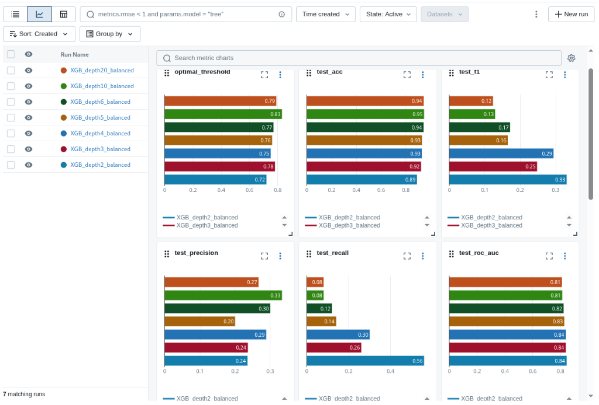
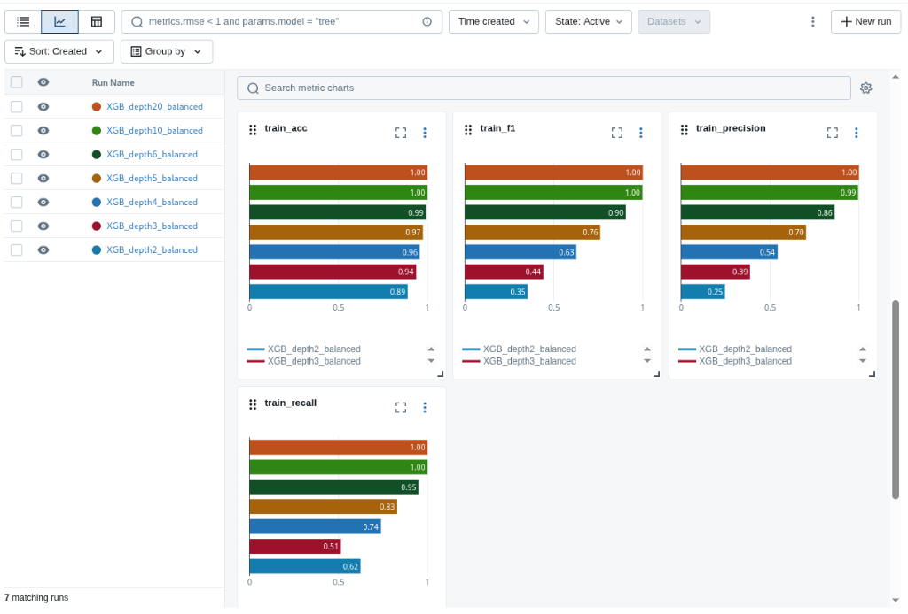
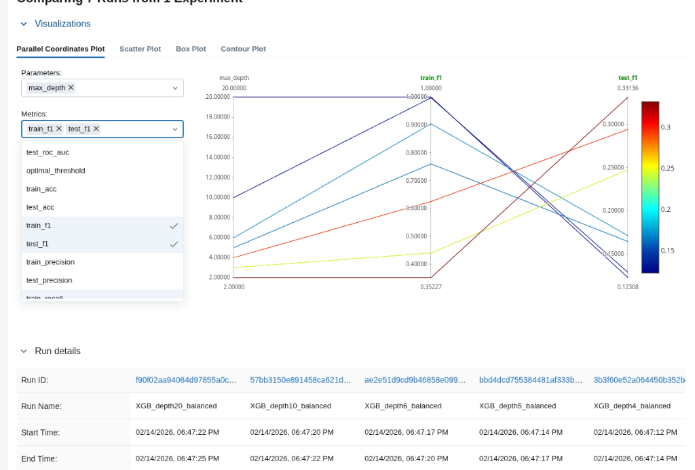
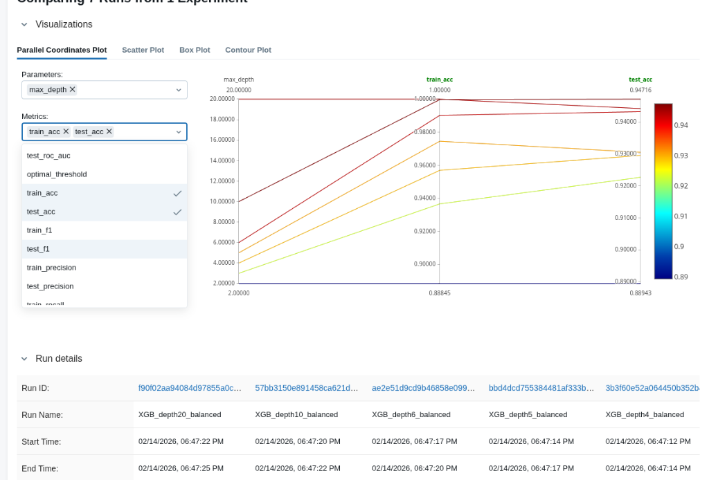
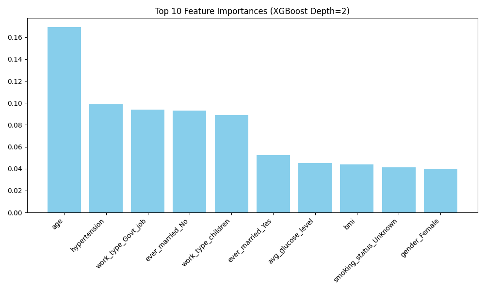

# Лабораторна робота №1: MLOps Environment & Experiment Tracking

Ця лабораторна робота присвячена налаштуванню професійного середовища для Data Science, структуруванню проекту та автоматизації відстеження експериментів за допомогою **MLflow**.

## Мета
Створення пайплайну навчання моделі для прогнозування інсульту (Stroke Prediction) з урахуванням сильного дисбалансу класів, використовуючи найкращі практики MLOps.

## Структура проекту
Проект організовано згідно зі спрощеним стандартом Cookiecutter Data Science:

```
mlops_lab_1/
├── data/
│   └── raw/            # Сирі дані (healthcare-dataset-stroke-data.csv)
├── notebooks/
│   └── 01_eda.ipynb    # Jupyter Notebook для аналізу даних (EDA)
├── src/
│   └── train.py        # Основний скрипт для навчання та логування експериментів
├── mlruns/             # Локальне сховище артефактів MLflow
├── models/             # Директорія для збереження моделей
├── venv/               # Віртуальне середовище
├── requirements.txt    # Залежності проекту
└── README.md           # Документація
```

## Як запустити

### 1. Налаштування середовища
Створіть віртуальне середовище та встановіть залежності:

```bash
# Створення venv
python3 -m venv venv

# Активація (Linux/MacOS)
source venv/bin/activate

# Встановлення бібліотек
pip install -r requirements.txt
```

### 2. Запуск EDA
Для перегляду аналізу даних запустіть Jupyter Notebook:

```bash
jupyter notebook notebooks/01_eda.ipynb
```

### 3. Тренування моделі
Запустіть скрипт `src/train.py`. Він автоматично виконає серію експериментів з різними гіперпараметрами (глибина дерева) та залогує результати в MLflow.

```bash
python src/train.py --n_estimators 200 --learning_rate 0.05
```

Скрипт виконує наступні кроки:
1.  Завантаження та препроцесинг даних.
2.  Розбиття на train/test (80/20).
3.  Навчання **XGBoost** з балансуванням класів (`scale_pos_weight`).
4.  Підбір оптимального порогу класифікації (Threshold Tuning) для максимізації F1-score.
5.  Логування метрик (Accuracy, F1, Precision, Recall, ROC-AUC) та артефактів (Confusion Matrix, Feature Importance).

### 4. Перегляд результатів (MLflow UI)
Щоб порівняти експерименти візуально:

```bash
mlflow ui
```
Відкрийте у браузері: [http://127.0.0.1:5000](http://127.0.0.1:5000)

## Результати та Аналіз
В ході експериментів було протестовано XGBoost з різною глибиною дерев (`max_depth`: 2, 3, 4, 5, 6, 10, 20).

**Ключові спостереження (на основі MLflow):**

1.  **Дисбаланс Класів**:
    *   Дані мають сильний дисбаланс (~1:19).
    *   Використання `scale_pos_weight` дозволило моделі звертати увагу на мінорний клас, але призвело до значної кількості False Positives (низький Precision).

2.  **Залежність від Глибини Дерева (Overfitting)**:
    *   Зі збільшенням глибини дерева (`max_depth > 4`) спостерігається **різке перенавчання**.
    *   Метрики на тренувальній вибірці (`train_f1`, `train_recall`) досягають **1.0**, тоді як на тестовій падають (див. графік `train_f1` vs `test_f1`).
    *   Глибокі дерева "запам'ятовують" шум, втрачаючи здатність узагальнювати.

3.  **Найкраща Модель (Depth=2)**:
    *   Найкращі результати показала модель з `max_depth=2`.
    *   **Test F1-score:** ~0.33 (найвищий серед усіх експериментів).
    *   **Test Recall:** ~0.56 (модель виявляє більше половини пацієнтів з ризиком інсульту).
    *   **Test Precision:** ~0.24 (кожен четвертий прогноз "інсульт" є правильним).
    *   **Test ROC-AUC:** ~0.84 (вказує на хорошу роздільну здатність моделі).

4.  **Optimal Threshold**:
    *   Автоматичний підбір порогу класифікації показав, що оптимальне значення знаходиться в діапазоні **0.72–0.83** (значно вище стандартного 0.5), що дозволило максимізувати F1-score.

### Візуалізація Результатів (MLflow)

> **Примітка**: Нижче наведені скріншоти з результатами експериментів.

**Порівняння метрик (Parallel Coordinates & Bar Charts):**

*Порівняння основних метрик (Recall, F1, Accuracy) для різних глибин дерев.*


*Демонстрація перенавчання (Overfitting): Train F1 = 1.0 vs Test F1 << 0.5 для глибоких дерев.*

**Детальний аналіз експериментів:**

*Зведена таблиця результатів з MLflow.*


*Аналіз залежності метрик від гіперпараметрів (max_depth).*

**Важливість ознак (Feature Importance):**

*Топ-10 найважливіших ознак для моделі XGBoost (Depth=2). Найбільший вплив має **Вік (age)**, що узгоджується з медичними даними, а також рівень глюкози та індекс маси тіла.*

## Технології
*   **XGBoost**: Градієнтний бустинг (основний алгоритм).
*   **Scikit-learn**: Pipeline, ColumnTransformer, Metrics.
*   **Imbalanced-learn** / **Weights**: Обробка дисбалансу класів.
*   **MLflow**: Логування метрик, параметрів та артефактів.
*   **Pandas, NumPy, Matplotlib, Seaborn**: Аналіз даних та візуалізація.

