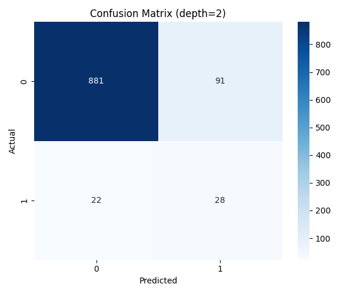

# Звіт: Лабораторна Робота №4
**CI/CD для ML-проєктів: автоматизація тестування та звітності з GitHub Actions та CML**

---

## 1. Мета роботи

1. Впровадити принципи Continuous Integration та Continuous Delivery для ML-проєкту.
2. Налаштувати автоматизований workflow за допомогою **GitHub Actions**.
3. Реалізувати автоматичну генерацію звітів у Pull Request за допомогою **CML (Continuous Machine Learning)**.
4. Додати unit-тести для валідації даних та артефактів моделі за допомогою **pytest**.
5. Реалізувати концепцію **Quality Gate** для автоматичного прийняття або відхилення моделі на основі метрик.

---

## 2. Реалізація CI/CD Пайплайна

### 2.1 Конфігурація GitHub Actions (`.github/workflows/cml.yaml`)

Створений workflow виконує наступні кроки при кожному Push у гілки `main`/`master` або при створенні Pull Request:

1. **Checkout**: завантаження коду репозиторію.
2. **Environment Setup**: встановлення Python 3.11 та інсталяція залежностей з `requirements.txt`.
3. **Linting**:
   - `flake8`: перевірка синтаксичних помилок та стилю коду.
   - `black`: перевірка форматування коду.
4. **Training (CI Mode)**: запуск `src/train.py` з прапорцем `--ci`. Цей режим проводить швидке тренування (лише одну ітерацію по глибині), щоб зекономити час обчислень у CI.
5. **Testing**: запуск `pytest` для перевірки даних та результатів.
6. **CML Report**: генерація та публікація звіту в коментарях до Pull Request.
7. **Artifact Upload**: при злитті (merge) у `main` модель автоматично зберігається як GitHub Artifact.

### 2.2 Тестування (`tests/`)

Реалізовано дві групи тестів:

*   **Pre-train (`test_data.py`)**:
    - Перевірка наявності файлів `train.csv` та `test.csv`.
    - Валідація схеми даних (наявність обов'язкових колонок: `stroke`, `age`, `hypertension` тощо).
    - Перевірка, що набори даних не порожні.

*   **Post-train (`test_artifacts.py`)**:
    - Перевірка створення артефактів: `model.pkl`, `metrics.json`, `confusion_matrix.png`.
    - **Quality Gate**: перевірка, що `test_f1 >= 0.2` та `test_roc_auc >= 0.75`.

---

## 3. Результати та Артефакти

### 3.1 Генерація метрик (`metrics.json`)

Скрипт тренування тепер автоматично зберігає фінальні метрики у форматі JSON:
```json
{
    "test_f1": 0.3314,
    "test_acc": 0.8894,
    "test_roc_auc": 0.8441,
    "test_precision": 0.2353,
    "test_recall": 0.5600,
    "optimal_threshold": 0.72,
    "max_depth": 2
}
```

### 3.2 CML Звіт

Приклад автоматичного звіту, який CML публікує в Pull Request:

> ## Model Metrics (CI Run)
> | Metric | Value |
> | --- | --- |
> | Test F1 | 0.3314 |
> | Test ROC-AUC | 0.8441 |
> | Test Accuracy | 0.8894 |
> 
> ## Visualization
> 
> 
> ### Quality Gate
> - F1 threshold: 0.2 ✅
> - ROC-AUC threshold: 0.75 ✅

---

## 4. Висновки

1. **Автоматизація**: Впровадження CI пайплайна дозволяє уникнути помилок при злитті коду, автоматично перевіряючи його на відповідність стандартам та якість моделі.
2. **Quality Gates**: Встановлення порогів для метрик гарантує, що в основну гілку не потраплять моделі, які працюють гірше за встановлений мінімум.
3. **CML**: Використання CML значно полегшує процес Code Review в ML-проєктах, оскільки результати експериментів (графіки та метрики) доступні безпосередньо у PR.
4. **Відтворюваність**: Поєднання Git, DVC та GitHub Actions забезпечує повний контроль над циклом розробки моделі.

---

## 5. Посилання

- [GitHub Actions Documentation](https://docs.github.com/en/actions)
- [CML (Continuous Machine Learning)](https://cml.dev/)
- [Pytest Documentation](https://docs.pytest.org/)
